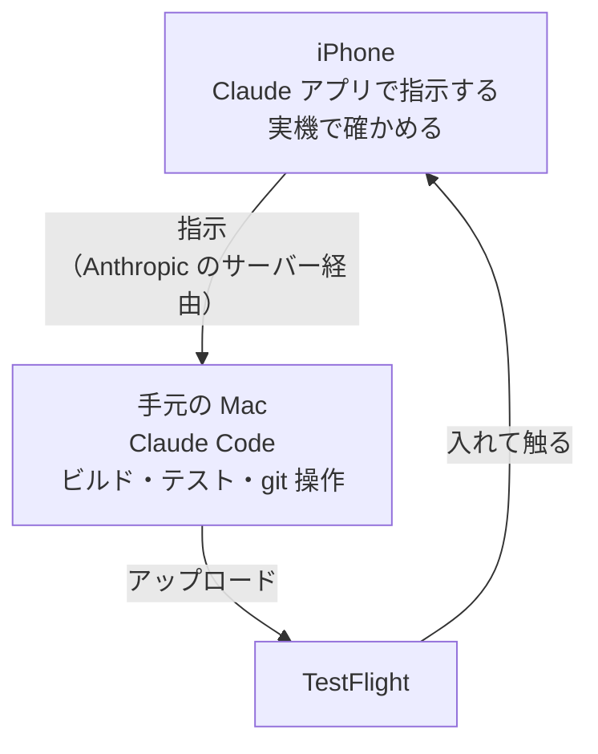

# はじめに

みなさん、最近モバイルアプリの開発はどうしていますか？

AIが実装してくれるようになったので、バイブコーディングしている人も多いと思います。とはいえ、当たり前ですがPCの前でやっていますよね。

なので移動中にも進めたいとなると、ノートPCを持って出て、プロンプトを投げて、待っているあいだは半開きにして持ち歩き（閉じるとスリープして止まるので）、終わったら開いて次のプロンプトを投げて、また半開きにして……を繰り返していた人もいるかもしれません。自分がそうでした。こんな感じです。

<!-- TODO: ノートPCを半開きにしたまま歩いている写真を入れる -->
<!--  -->

そんな人に向けて、**Claudeアプリを使えば、PCを持ち歩かなくてもスマホだけでモバイル開発ができる**、ということを紹介します。

個人で作っている英語学習アプリ（マチリンガル）で、実際にやっている流れで書きます。

# 先に結論

家に置いてあるMacでClaude Codeを動かしたままにしておけば、スマホのClaudeアプリから指示するだけで、直す → 配信する → 実機で確かめる、までが外にいてもできちゃいます。

# 何がどこで動いているか

**スマホの中では何も動いていません。** ビルドもテストもgit操作も、走っているのは全部手元のMacです。スマホがやっているのは、指示を送るのと、Macで起きたことを見ることだけです。



ドキュメントにもはっきり書いてあります。

> When you start a Remote Control session on your machine, Claude keeps running locally the entire time, so your code execution and filesystem access stay on your machine.

> Remote Controlのセッションを自分のマシンで開始している間、Claudeはずっとローカルで動き続けるので、コードの実行とファイルシステムへのアクセスは自分のマシンに留まる。

なので「スマホで開発する」というより、**Macに指示を出して結果を受け取る口がスマホになる**、が近いです。クラウドで動くClaude Code on the webとはそこが違います。

# 準備: Remote Controlをつなぐ

起動のしかたは何通りかあって、どれでもつながります。

```bash
# サーバーモード。プロジェクトのディレクトリで起動しっぱなしにして待ち受ける
claude remote-control

# 普通の対話セッションを Remote Control 付きで起動する
claude --remote-control   # --rc でも同じ

# すでに作業中のセッションを、そのまま引き継いで外に出す
/remote-control           # /rc でも同じ
```

ターミナルで作業していて出かけることになった、というときは3つ目が楽です。会話をそのまま引き継いで、続きをスマホで見られます。全セッションで自動的に有効にしたい場合は`/config`の「Enable Remote Control for all sessions」をonにします。

<!-- TODO: 自分がいつもどれで起動しているか（決めていないならこの TODO ごと削る）を本人が加筆 -->

スマホ側は、Claudeアプリの**Code**タブにセッションが並びます。オンラインのものはPCのアイコンに緑の点が付きます。サーバーモードならターミナルでスペースキーを押すとQRコードが出るので、それを読むのが早いです（アプリ自体が入っていなければ`/mobile`でダウンロード用のQRが出ます）。

通知も設定しておくといいです。`/config`で

- **Push when Claude decides**（長い処理が終わったときなどにClaudeの判断で飛ぶ）
- **Push when actions required**（許可を聞かれたときや質問されたときに飛ぶ）

の2つを有効にできます。ビルドと配信で10分近くかかるので、「終わったら教えて」と言っておいて放っておけるのが効きます。

:::message
Remote Controlは**ローカルのプロセスが生きている必要**があります。

> Local process must keep running: Remote Control runs as a local process. If you close the terminal, quit VS Code, or otherwise stop the `claude` process, the session goes offline until you bring it back.

> Remote Controlはローカルのプロセスとして動く。ターミナルを閉じる、VS Codeを終了する、その他`claude`プロセスを止めると、復帰させるまでセッションはオフラインになる。

出かける前にターミナルを閉じないこと。SSH越しに起動しているなら`tmux`や`screen`の中で動かしておきます。
:::

# TestFlightへ配信して、実機で確かめる

外にいるとiPhoneをMacにつなげないので、実機にはTestFlight経由で入れます。

配信の手順は`/merge-and-deploy`というスキルにしてあって、スマホからはこれを打つだけです。Mac側でテストを回して、マージして、TestFlightへアップロードするところまで走ります。スマホで「さっきと同じことをして」と言うより、手順を1本の名前にしておくほうが、細い入力で確実に動きます。

アップロードが終わったら、TestFlightの処理が終わるのを待って、iPhoneのTestFlightアプリから入れて触ります。ここまでMacには触っていません。

# おわりに

しばらくやってみて、やっぱりノートPCを持ち歩かなくてよくなったのが大きいです。気になったところをその場で直して、配信して、TestFlightで触る、までが外にいるあいだに終わります。歩きながら半開きのノートPCを抱えることもなくなりました。Macは起動したままにしておくだけです。

とはいえビルドが走るのは自分のMacなので、当然ながらMacが寝ていると何も起きません。そこだけ気をつければ、PCの前にいる必要はだいぶ減るなと思います。

<!-- TODO: 外にいて助かった具体例（こういう場面でその場で直せた、という話）があれば本人が加筆 -->

<!-- TODO: 通知（Push when Claude decides / actions required）を実際に使っているか、使っていなければこの段落を削るかを本人が判断 -->

<!-- TODO: 次にやりたいこと（Android も同じ流れにする？ App Store 本番配信も？）を本人が加筆 -->

# 参考

- https://code.claude.com/docs/en/remote-control
- https://developer.apple.com/documentation/xcode/distributing-your-app-for-beta-testing-and-releases
