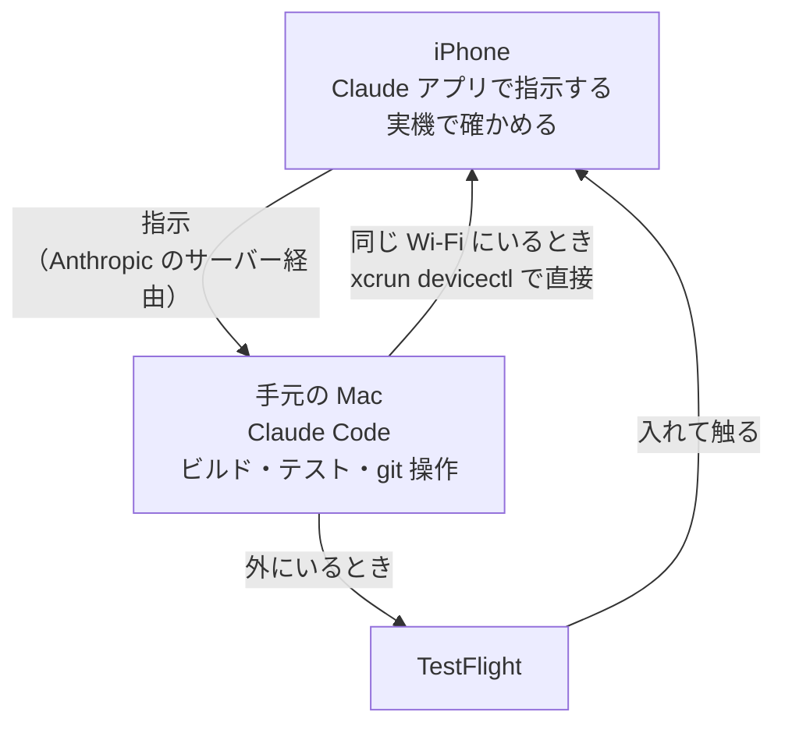

# はじめに

モバイルアプリって、PCがないと確認が難しいです。直したものを実機で見るにはビルドが要るし、iOSならMacが要ります。なので電車でもノートPCを半開きにしてClaudeを動かしてました。

ただ、Claude CodeのRemote Controlはスマホのアプリから手元のMacをそのまま動かせるので、それならビルドも配信もMacにやらせて、確認だけiPhoneでやればいいのでは？と思ってやってみたら、普通にできました。**PCを持って歩く必要がなくなった**のがいちばん大きいです。

個人で作っている英語学習アプリ（マチリンガル）でやっていることをめもっとく。

# 何がどこで動いているか

大事なのは、**スマホは窓でしかない**ということです。



ドキュメントにもはっきり書いてあります。

> When you start a Remote Control session on your machine, Claude keeps running locally the entire time, so your code execution and filesystem access stay on your machine.

> Remote Controlのセッションを自分のマシンで開始している間、Claudeはずっとローカルで動き続けるので、コードの実行とファイルシステムへのアクセスは自分のマシンに留まる。

なので「スマホで開発する」というより、**Macに指示を出して結果を受け取る口がスマホになる**、が近いです。クラウドで動くClaude Code on the webとはそこが違います。

# 準備: Remote Controlをつなぐ

起動のしかたは何通りかあって、どれでもつながります。

```bash
# サーバーモード。プロジェクトのディレクトリで起動しっぱなしにして待ち受ける
claude remote-control

# 普通の対話セッションを Remote Control 付きで起動する
claude --remote-control   # --rc でも同じ

# すでに作業中のセッションを、そのまま引き継いで外に出す
/remote-control           # /rc でも同じ
```

ターミナルで作業していて出かけることになった、というときは3つ目が楽です。会話をそのまま引き継いで、続きをスマホで見られます。全セッションで自動的に有効にしたい場合は`/config`の「Enable Remote Control for all sessions」をonにします。

<!-- TODO: 自分がいつもどれで起動しているか（決めていないならこの TODO ごと削る）を本人が加筆 -->

スマホ側は、Claudeアプリの**Code**タブにセッションが並びます。オンラインのものはPCのアイコンに緑の点が付きます。サーバーモードならターミナルでスペースキーを押すとQRコードが出るので、それを読むのが早いです（アプリ自体が入っていなければ`/mobile`でダウンロード用のQRが出ます）。

通知も設定しておくといいです。`/config`で

- **Push when Claude decides**（長い処理が終わったときなどにClaudeの判断で飛ぶ）
- **Push when actions required**（許可を聞かれたときや質問されたときに飛ぶ）

の2つを有効にできます。ビルドと配信で10分近くかかるので、「終わったら教えて」と言っておいて放っておけるのが効きます。

:::message
Remote Controlは**ローカルのプロセスが生きている必要**があります。

> Local process must keep running: Remote Control runs as a local process. If you close the terminal, quit VS Code, or otherwise stop the `claude` process, the session goes offline until you bring it back.

> Remote Controlはローカルのプロセスとして動く。ターミナルを閉じる、VS Codeを終了する、その他`claude`プロセスを止めると、復帰させるまでセッションはオフラインになる。

出かける前にターミナルを閉じないこと。SSH越しに起動しているなら`tmux`や`screen`の中で動かしておきます。
:::

# 外にいるとき: TestFlightへ配信する

外出先だと当然iPhoneをMacに繋げないので、TestFlight経由にします。スマホから`/merge-and-deploy`と打つと、Mac側で次が走ります。

## 1. マージする前に、実際にテストを回す

ここは「通るはず」で飛ばさないようにしています。このリポジトリでは`main`へのpushでサーバー（Render）の本番とstagingが両方デプロイされるので、マージ自体が配信の引き金になっているからです。

```bash
./gradlew testDebugUnitTest        # クライアント全モジュール
./gradlew :server:test             # サーバーを触っていれば
```

落ちたらマージせずに止めてもらいます。スマホから見ていると「進んでいる」以外の情報が入ってこないので、止まる条件を先に決めておくのが大事でした。

## 2. 配信はサブエージェントに渡す

TestFlightへの1回はアーカイブ → 書き出し → 検証 → アップロードで**ログが数百行**出ますし、8〜10分かかります。これを本体の会話に流すと文脈を食い尽くすので、配信だけサブエージェントに渡しています。スマホの画面に数百行流れないのも実際ありがたいです。

渡すときは「いい感じにデプロイして」ではなく**手順そのものを渡します**。失敗したときに勝手なリトライをされると困るので、プロンプトに次を必ず入れています。

- `./scripts/deploy-speak-testflight.sh`を実行する（`--dry-run`へ勝手に切り替えない）
- スクリプトはコミットもタグも作らない。成功したらビルド番号の1行だけをコミットして、`ios-speak/v0.1.0+N`を同じコミットに付けてpushする
- 署名やビルド番号の重複で落ちたらリトライせずに報告する
- 推測で成功と書かない。コマンドの出力で確認できたことだけ

## 3. 待っているあいだ、作業ツリーを触らない

これは実際にやらかしました。

配信は**手元のMacの、その作業ツリーで**走ります。サブエージェントに渡したからといって別の場所で走っているわけではありません。8〜10分あると別の作業を始めたくなるのですが、配信中にスキルを作ろうとしてブランチを切ったら、ビルド番号を上げるコミットが`main`ではなくfeatureブランチに乗りました。

このときはドキュメントしか触っていなかったので無害でしたが、ソースを変えるコミットが挟まっていたら「`main`のソースではないものを配信した」ことになりますし、しかも**成果物はもうApple側にあります**。

なので待っているあいだにやるのは、作業ツリーを触らないもの（issueを書く、ログを読む、設計を考える）に限る、と決めました。どうしても並行して直したいなら`git worktree`で別ディレクトリを作ります。スマホから指示を出していると「いま何が動いているか」を忘れやすいので、ここは明文化しておいてよかったところです。

## 4. 報告を鵜呑みにしない

戻ってきたら自分で確かめます。

```bash
git fetch origin
git log --oneline -1 origin/main
git tag --list 'ios-speak/*' | sort -V | tail -2
git ls-remote --tags origin | grep "ios-speak/v0.1.0+<N>"
git status --short                                  # 空であること
```

`sort -V`は版番号順です。辞書順で見ると`+9`が`+30`より後に来るので、最新のタグを見ているつもりで古いものを見ます。

あとはTestFlightの処理が終わるのを待って、iPhoneのTestFlightアプリから入れて触ります。ここまでMacには触っていません。

# 家にいるとき: 直接入れる

Macと同じWi-Fiにいるなら、TestFlightを通さずに直接入れたほうが速いです。Appleの処理待ちが要りません。こちらは`/merge-and-install`にしてあります。

このアプリは発音を採点するので、実機で触ってみないと分からないことが多いです。パスキーの入口をどこに置くかは何回も動かしました。机上では「1つで足りる」と見えていて、実機で触って初めて「その画面に来る人が誰か」で決まると分かるやつです。なので入れ直す回数が多くて、速いほうがありがたい。

端末を選んで、

```bash
xcrun devicectl list devices
```

`State`が`available (paired)`のiPhoneのUDIDを控えて、ビルドして入れます。アプリはKMP + Compose Multiplatformで、iOSは`iosSpeakApp/`という別のXcodeプロジェクトにしてあります。

```bash
OUT=/tmp/iosbuild.log
xcodebuild -project iosSpeakApp/iosSpeakApp.xcodeproj -scheme iosSpeakApp \
  -configuration Debug -destination "id=<UDID>" \
  -derivedDataPath build/ios -allowProvisioningUpdates build > "$OUT" 2>&1
if grep -q "BUILD SUCCEEDED" "$OUT"; then
  xcrun devicectl device install app --device <UDID> \
    "build/ios/Build/Products/Debug-iphoneos/Machilingual.app"
else
  grep -m5 "error:" "$OUT"
fi
```

ポイントは2つで、**ログはファイルへ逃がして末尾だけ見る**のと、**バックグラウンドで走らせる**ことです。数百行がそのまま流れてくると、スマホから見ているときは特に何も分かりません。

もう1つ、スキルに「**入れましたで終わらせない**」と書いています。入れた変更について、**押す場所と期待する見え方**を書いてもらう、というものです。実機を触るときに見ているのは差分ではなく画面なので、「設定タブの下に引き継ぎが出るはず」まで書いてあると、スマホだけで確認が完結します。

# 同じことを2回やったらスキルにする

上の`/merge-and-install`と`/merge-and-deploy`は、最初から在ったわけではなくて、実機に入れるのと配信するのを1日に何度も手で回したあとに畳んだものです。毎回やること（テストを回してからマージする・ログをファイルへ逃がす・報告を自分で確かめる）が同じだったので、そのままスキルにしました。

このスキル自体も外から作りました。スマホで「さっきと同じことをして」と言うより、手順を1本の名前にしておくほうが、細い入力で確実に動きます。

# 踏んだこと

## entitlementを足すと、TestFlightの書き出しだけが落ちる

Associated Domainsを足した直後、実機へのインストールは通るのにTestFlightの書き出しだけが落ちました。

```
exportArchive ... doesn't include the Associated Domains capability
```

実機は自動署名なので通ってしまい、**配布用のプロビジョニングプロファイルが古いことに配信の直前まで気づけない**というやつです。直すにはDeveloper Portalでプロファイルを作り直してダウンロードする必要があって、ここはApple側のログインが要るので**自動化できません**。

なので今は、entitlementを足したらその場で「次のTestFlightで配布用プロファイルの作り直しが要る」と伝えてもらうようにしています。

## 実機とTestFlightで見えるものが違う

実機ビルドは`SPEAK_ENV = staging`、TestFlightは`production`を向いています。サーバー側の設定で出方が変わるもの（パスキーの入口など）は、**実機で出てもTestFlightで出ない**ことがあります。

「実機で確認済み」と言うときに、どちらのサーバーの話なのかを添えないと噛み合わないので、これも書いておきました。

# 配信を手元のMacからやっている理由

ここまで全部「手元のMacから」なので、CIに載せないのか？という話になるのですが、意識的に載せていません。

1. **署名の材料をCIに預けない。** App Store ConnectのAPIキー・配布用プロビジョニングプロファイル・Androidのkeystoreは、置いた数だけ漏れる面が増えます。手元のMacなら`~/Library/MobileDevice/Provisioning Profiles/`とKeychainにあるものをそのまま使えます
2. **配信の途中にAppleのログインが要る操作が挟まる。** さっきのプロファイルの作り直しがそれで、CIに載せても落ちるたびに手元へ戻ることになります
3. **タグpushを配信の引き金にしない。** 引き金にすると、打ち間違えた瞬間に配信が始まります。手元から回せば、打つ前に`--dry-run`で確かめられます

タグは**配信できたものを指す印**であって、起動条件ではない、という整理にしています。

そして、この「手元のMacから配信する」がRemote Controlと相性がいいです。CIに載せていたら「タグをpushする」だけが外からできることで、落ちたら結局帰るまで何もできません。Macそのものを動かせるなら、落ちたところから続きをやれます。

# おわりに

しばらくやってみて、やっぱりノートPCを持ち歩かなくてよくなったのが大きいです。気になったところをその場で直して、配信して、TestFlightで触る、までが外にいるあいだに終わります。Macは起動したままにしておくだけ。

とはいえビルドが走るのは自分のMacなので、当然ながらMacが寝ていると何も起きません。そこだけ気をつければ、PCの前にいる必要はだいぶ減るなと思います。

<!-- TODO: 外にいて助かった具体例（こういう場面でその場で直せた、という話）があれば本人が加筆 -->

<!-- TODO: 通知（Push when Claude decides / actions required）を実際に使っているか、使っていなければこの段落を削るかを本人が判断 -->

<!-- TODO: 次にやりたいこと（Android も同じ流れにする？ App Store 本番配信も？）を本人が加筆 -->

# 参考

- https://code.claude.com/docs/en/remote-control
- https://developer.apple.com/documentation/xcode/distributing-your-app-for-beta-testing-and-releases
