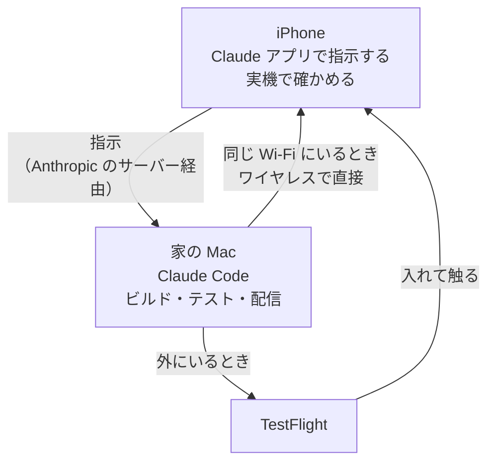

# はじめに

みなさん、最近モバイルアプリの開発はどうしていますか？

AIが実装してくれるようになったので、バイブコーディングしている人も多いと思います。とはいえ、当たり前ですがPCの前でやっていますよね。

なので移動中にも進めたいとなると、ノートPCを持って出て、プロンプトを投げて、待っているあいだは半開きにして持ち歩き（閉じるとスリープして止まるので）、終わったら開いて次のプロンプトを投げて、また半開きにして……を繰り返していた人もいるかもしれません。自分がそうでした。こんな感じです。


そんな人に向けて、**Claudeアプリを使えば、PCを持ち歩かなくてもスマホだけでモバイル開発ができる**、ということを紹介します。

個人で作っている英語学習アプリ（マチリンガル）で、実際にやっている流れで書きます。

# 先に結論

家に置いてあるMacでClaude Codeを動かしたままにしておけば、スマホのClaudeアプリから指示するだけで、直す → 配信する → 実機で確かめる、までが外にいてもできちゃいます。

これを成り立たせているのは、**スマホからMacのセッションを操作できること**と、**Macで作ったものが手元の実機に届くこと**です。この2本の道さえ通しておけば、あとは外から指示するだけになります。

どちらも外からは通せないので、出かける前にやっておきます。

# 仕組みを用意する

## Remote Controlでセッションをつなぐ

プロジェクトのディレクトリで、Remote Control付きでClaude Codeを起動します。

```bash
claude --remote-control   # --rc でも同じ
```

これでこのセッションが、スマホのClaudeアプリの**Code**タブから操作できるようになります。すでにターミナルで作業していて出かけることになった、というときは、そのセッションで`/remote-control`（`/rc`）と打てば、会話を引き継いだまま外に出せます。

<!-- TODO: いつも使っている起動方法に直す（--rc / claude remote-control / /rc のどれか） -->

:::message
Remote Controlは**ローカルのプロセスが生きている必要**があります。ターミナルを閉じて`claude`プロセスが止まると、セッションはオフラインになります。出かける前に閉じないこと。SSH越しに起動しているなら`tmux`や`screen`の中で動かしておきます。

**Macがスリープしても止まります。** 家に置いていくので、自動スリープに入るとそこから先は進みません。電源アダプタにつないだままにして、システム設定の「バッテリー」で、電源アダプタ接続時は自動スリープしないようにしておきます。`pmset -g custom`の`AC Power`が`displaysleep 0`になっていれば、ディスプレイが消えないので、そのあとの自動スリープにも入りません。
:::

## 手元から配信できるようにしておく

外にいるとスマホをMacにつなげないので、実機に入れる経路を先に用意しておきます。iOSならTestFlight、AndroidならFirebase App DistributionやPlay Consoleの内部テスト・クローズドテストです。

大事なのは、**手元のMacからコマンドで配信できる状態にしておく**ことです。ここがGUIの操作を挟む状態のままだと、外から指示しても最後で止まります。

# スマホから開発する

あとはClaudeアプリから、いつもと同じように「◯◯の画面を作って」と投げるだけです。

できたら「配信して」と投げます。スマホから見ているだけなので、シミュレータもエミュレータもありません。動かして確かめたければ、実機に入れるしかないからです。ここは**スキルにしておくと楽**です。自分は`/merge-and-deploy`と打つだけで、テストを回す → マージする → TestFlightへアップロードする、まで走るようにしてあります。

配信は10分近くかかるので、`/config`でプッシュ通知を有効にしておいて、終わったら教えてもらいます。

<!-- TODO: 通知（Push when Claude decides / actions required）を実際に使っているか、使っていなければこの一文を削るかを本人が判断 -->

しばらくするとTestFlightに届くので、iPhoneのTestFlightアプリから入れて、さっき作ってもらった画面を実機で確認します。

これで、PCを常に持ち歩く必要はなくなりました。

# 家にいるときは、配布サービスを通さない

Macと同じWi-Fiにいるなら、iOSはワイヤレスでデバッグインストールできます。「実機にインストールして」と言えば、TestFlightを通さずに実機へ入ります。Appleの処理待ちがないぶん速いです。

なので、横になったままでも、スマホさえ見られれば開発できます。

# まとめ: 何がどこで動いているか

ここまでのとおり、**スマホの中では何も動いていません。** ビルドもテストもgit操作も、走っているのは全部家のMacです。スマホがやっているのは、指示を送るのと、Macで起きたことを見ることだけです。



なので「スマホで開発する」というより、**Macに指示を出して結果を受け取る口がスマホになる**、が近いです。クラウドで動くClaude Code on the webとはそこが違います。

# おわりに

しばらくやってみて、やっぱりノートPCを持ち歩かなくてよくなったのが大きいです。気になったところをその場で直して、配信して、TestFlightで触る、までが外にいるあいだに終わります。歩きながら半開きのノートPCを抱えることもなくなりました。Macは起動したままにしておくだけです。

とはいえビルドが走るのは自分のMacなので、当然ながらMacが寝ていると何も起きません。そこだけ気をつければ、PCの前にいる必要はだいぶ減るなと思います。

<!-- TODO: 外にいて助かった具体例（こういう場面でその場で直せた、という話）があれば本人が加筆 -->

<!-- TODO: 次にやりたいこと（Android も同じ流れにする？ App Store 本番配信も？）を本人が加筆 -->

# 参考

- https://code.claude.com/docs/en/remote-control
- https://developer.apple.com/documentation/xcode/distributing-your-app-for-beta-testing-and-releases
