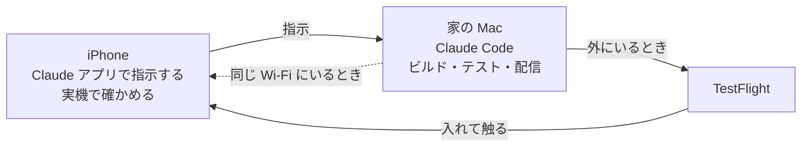

# はじめに

モバイルアプリ開発者のみなさん、AIエージェントを使った最近の開発はどうしていますか？

実装はAIに任せて、バイブコーディングしている人も多いと思います。とはいえ、当たり前ですがPCの前でやっていますよね。

せっかく任せられるなら、移動中にも指示を出して進めてもらいたくなります。そこでノートPCを持って出て、プロンプトを投げて、待っているあいだは半開きにして持ち歩き（閉じるとスリープして止まるので）、終わったら開いて次のプロンプトを投げて、また半開きにして……を繰り返していた人もいるかもしれません。自分がそうでした。最近、こんな感じの人をよく見かける気がします。


そんな人に向けて、**PCを持ち歩かなくてもスマホだけでモバイル開発ができる方法**、を紹介したいと思います。

# 仕組みを用意する

外にいるあいだに必要になるのは、次の2つです。

- **スマホからMacのClaude Codeを操作できること**
- **Macで作ったアプリを手元の実機に入れられること**

どちらも外からは用意できないので、出かける前にやっておきます。

## Remote Controlでセッションをつなぐ

プロジェクトのディレクトリで、Remote Control付きでClaude Codeを起動します。

```bash
claude --remote-control   # --rc でも同じ
```

これでこのセッションが、スマホのClaudeアプリの**Code**タブから操作できるようになります。すでにターミナルで作業していて出かけることになった、というときは、そのセッションで`/remote-control`（`/rc`）と打てば、会話を引き継いだまま外に出せます。Remote Controlがつながればどれでも同じなので、やりやすいほうで大丈夫です。

## 手元から配信できるようにしておく

外にいるとスマホをMacにつなげませんし、iOS SimulatorやAndroid Emulatorに入れたとしても、それをスマホから見ることができません[^remote-desktop]。なので、実機に入れる経路を先に用意しておきます。iOSならTestFlightやFirebase App Distribution、AndroidならFirebase App DistributionやPlay Consoleの内部テスト・クローズドテストです。

大事なのは、**コマンドで配信できる状態にしておく**ことです。ここがGUIの操作を挟む状態のままだと、外から指示しても最後で止まります。

配信するのは手元のMacでなくてもよく、GitHub ActionsなどのCIからでも構いません。ただ、CIは使い方によってはお金がかかることもあるので、自分のMacをCIのように使うのがいいかもしれません。

# スマホから開発する

あとはClaudeアプリから、いつもと同じように「◯◯の画面を作って」などと投げるだけです。

実装できたら、動作確認したくなると思います。「配信して」と投げれば配信してくれるので、TestFlightなどからインストールして確認できます。毎回「配信して」と入力するのは面倒なので、**スキルにしておくと楽**かもしれません。

配信には時間がかかるので、終わったら通知してくれるようにしておくといいと思います。

この繰り返しで、スマホアプリの開発ループができます。

これで、PCを常に持ち歩く必要はなくなりました。

# 家にいるときは、配布サービスを通さない

Macと同じWi-Fiにいるなら、iOSはワイヤレスでデバッグインストールできるので、「実機にインストールして」と言えば、TestFlightを通さずに実機へ入ります。Appleの処理待ちがないぶん速いです。

なので、横になったままでも、スマホさえ見られれば開発できます。

# 人の操作が要るところは、PCの前に戻る

Mac上のブラウザも、Claude in Chromeを使えばスマホから操作してもらえます。ただし、次のような**人の操作が要るところは、結局PCの前にいないと進みません**。

- ログイン（パスワードや2要素認証のコードの入力）
- CAPTCHA

ログインは、Developer PortalやApp Store Connect、Play Consoleを触るときに必要になります。配信そのものはコマンドで回せても、証明書やプロファイルを作り直すところだけは持ち帰りになります。

CAPTCHAのほうは、Devpostにハッカソンの提出を下書きしてもらっていたときに出ました。「自転車の画像をすべて選択してください」というもので、Claudeからも「私が解くことはできないので、ご本人でお願いします」と返ってきます。ここは自分でPCの前に行って通すしかありません。

# まとめ: 何がどこで動いているか

ここまでのとおり、**スマホの中では何も動いていません。** ビルドもテストもgit操作も、走っているのは全部家のMacです。スマホがやっているのは、指示を送るのと、Macで起きたことを見ることだけです。


```mermaid
graph LR
    Phone["iPhone<br/>Claude アプリで指示する<br/>実機で確かめる"]
    Mac["家の Mac<br/>Claude Code<br/>ビルド・テスト・配信"]
    TF["TestFlight"]

    Phone -->|"指示"| Mac
    Mac -->|"外にいるとき"| TF
    TF -->|"入れて触る"| Phone
    Mac -.->|"同じ Wi-Fi にいるとき"| Phone
```

なので「スマホで開発する」というより、**Macに指示を出して結果を受け取る口がスマホになる**、が近いです。クラウドで動くClaude Code on the webとはそこが違います。

# おわりに

しばらくやってみて、やっぱりノートPCを持ち歩かなくてよくなったのが大きいです。気になったところをその場で直して、配信して、TestFlightで触る、までが外にいるあいだに終わります。歩きながら半開きのノートPCを抱えることもなくなりました。Macは起動したままにしておくだけです。

とはいえ、動いているのは家のMacなので、Macがスリープしたり`claude`のプロセスが止まったりすると何も進みません。ログインやCAPTCHAのように、人の操作が要るところも残ります。それでも、PCの前にいないといけない場面はだいぶ減ったなと思います。

<!-- TODO: 外にいて助かった具体例（こういう場面でその場で直せた、という話）があれば本人が加筆 -->

<!-- TODO: 次にやりたいこと（Android も同じ流れにする？ App Store 本番配信も？）を本人が加筆 -->

# 参考

- https://code.claude.com/docs/en/remote-control
- https://developer.apple.com/documentation/xcode/distributing-your-app-for-beta-testing-and-releases
- https://developer.apple.com/documentation/xcode/running-your-app-in-simulator-or-on-a-device

[^remote-desktop]: スマホからリモートデスクトップでMacの画面を見られるようにしていれば、シミュレータやエミュレータも見られます。この記事ではその方法は使わない前提にしています。
